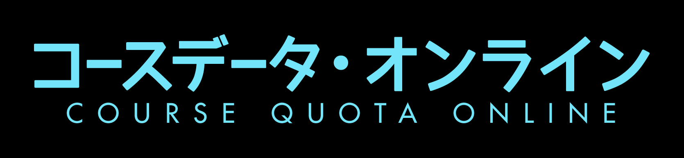

# Course-Quota-Online

Discord server to display all course quota information. 

## Server URL

https://discord.gg/qPFTXNKJ

## Please read:

**Welcome, betatesters.**

Features: 
- Statistics update of all course details
  - Important information, such as modification of course, timeslots, quota, etc will be put in -important Bot Zones and in -important channels
  - Other information in non-important Bot Zones and channels. 
- Debugging messages. 
- Boot-up logging. 

Usage:
- Manually unmute the channels / categories you are interested in. 

CQO is still under development. 
- Uptime is not guaranteed. 
- Features are subject to change. 
- Random notifications may be sent. 
- CQO cannot be added to existing servers yet. 

If you have any feedback, please DM.
